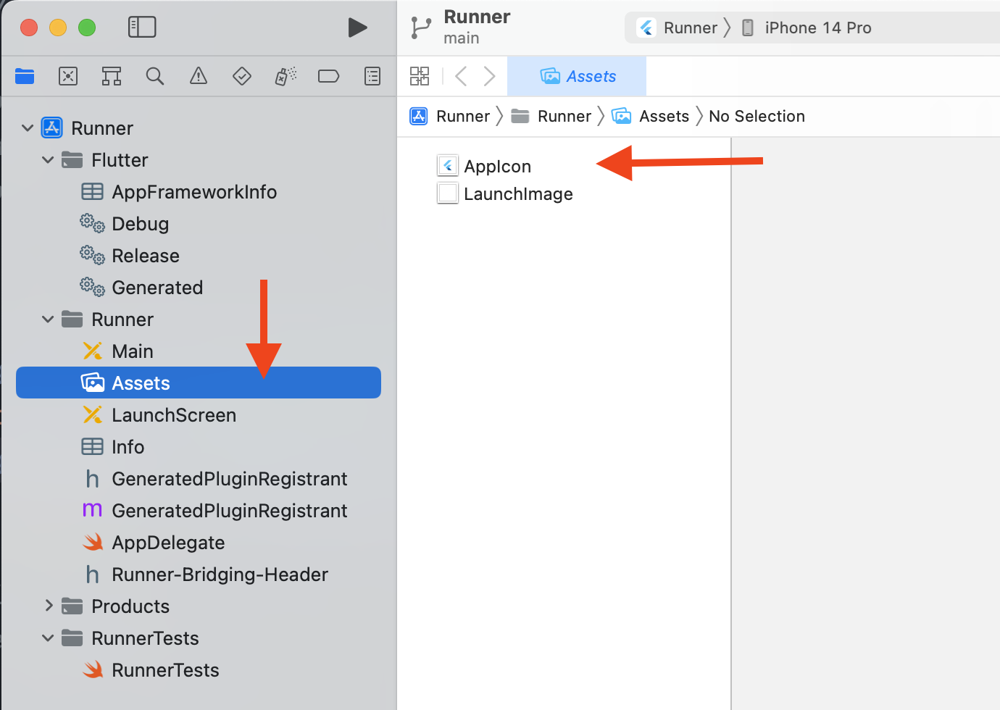
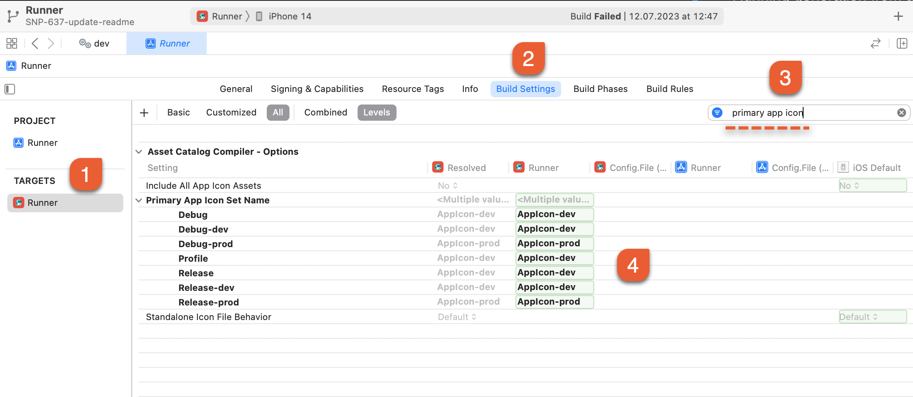
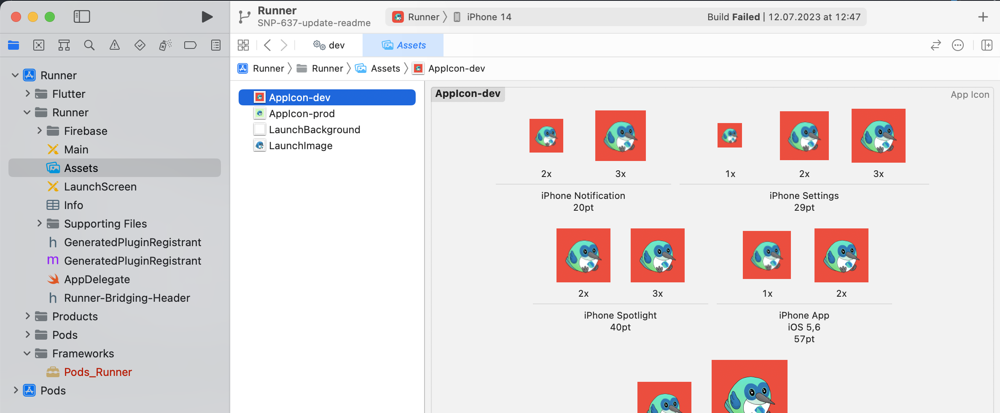

# Icons launcher

To generate icons, we use the flutter_launcher_icons package, as it generates adaptive icons.

The template contains basic icons. To replace them with yours, follow the recommendations.

## Image folder

In the root of the project in the assets folder we use the `assets` folder with the following structure:

``` text
- assets
   - launcher_icon
      - icon_background.png (If you don't want a gradient or textured background, you can remove this)
      - icon_background_dev.png
      - icon_foreground.png
      - icon_foreground_dev.png
      - icon_rectangle.png
      - icon_rectangle_dev.png
```

Designers should prepare basic files.


### Setting up Xcode

To generate icons for iOS, you need to check the Xcode settings. Open your project in Xcode, then navigate to Runner -> Assets.

Here, you'll find the default folder for icons named AppIcon.



Next, go to Target -> Runner -> Build Settings and search for the primary app icon. Make sure that there is an icon 
directory configured for each build type. If this is not the case, adjust the settings accordingly.



### Configuring image generation

Configuration files:
``` text
flutter_launcher_icons-dev.yaml
flutter_launcher_icons-prod.yaml
```

Icons will be generated in the appropriate folders:
``` text
Android:
android/app/scr/dev/res/
android/app/scr/prod/res/

IOS:
ios/runner/Assets.xcassets/AppIcon-dev.appiconset
ios/runner/Assets.xcassets/AppIcon-prod.appiconset
```
After generating, make sure that the icons have been generated correctly. You can delete the default `AppIcon` 
directory on iOS.



Data in default folders: android/app/scr/main/res/ and ios/runner/Assets.xcassets/AppIcon.appiconset **won't be generated**.

```text
flutter_launcher_icons:
  android: "ic_launcher"
  ios: true
  image_path_android: "assets/launcher_icon/icon_rectangle_dev.png"
  image_path_ios: "assets/launcher_icon/icon_rectangle_dev.png"
  min_sdk_android: 21 # android min sdk min:16, default 21
  adaptive_icon_background: "#FC3737"
  adaptive_icon_foreground: "assets/launcher_icon/icon_foreground_dev.png"
  remove_alpha_ios: true
  web:
    generate: false
    image_path: "assets/launcher_icon/icon_rectangle_dev.png"
    background_color: "#FC3737"
    theme_color: "#FC3737"
  windows:
    generate: false
    image_path: "assets/launcher_icon/icon_rectangle_dev.png"
    icon_size: 48 # min:48, max:256, default: 48
  macos:
    generate: false
    image_path: "assets/launcher_icon/icon_rectangle_dev.png"
```

### Generation

To start the generation, run the command:
```shell
# Starts generating icons from all customization files
dart run flutter_launcher_icons
```

## Useful links
- [Instructions on how to configure additional parameters](https://pub.dev/packages/flutter_launcher_icons)
- [UI Guide: Adaptive icons](https://developer.android.com/develop/ui/views/launch/icon_design_adaptive)
